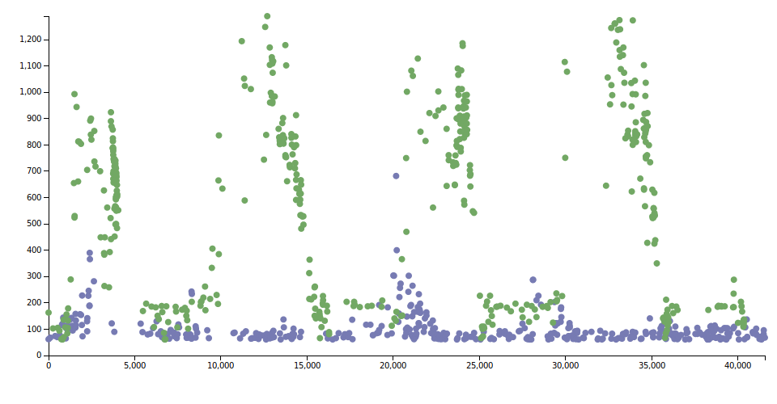

Websocket benchmark, NodeJS VS PHP
==================================

Run a simple chat application.

One is powered by socket.io (just reused the [official chat example](https://github.com/socketio/chat-example)),
and the other one is powered by [Sandstone](https://github.com/eole-io/sandstone).

They have both the same front web interface.

A same phantomJS script will create many users simultaneously sending messages.

The script will then measure some metrics, like delay between message send and receive.

Then benchmark result is rendered into a graphic.

**Note**: This is still a work in progress. Chat apps are in a dev environment
(i.e php chat webserver is run with `php -S`, wich is a single thread),
and benchmark script is experimental, and arbitrarily run with GNU parallel.


## Install

Needs NodeJs, npm, ZMQ, PHP, php-zmq, composer, GNU parallel (`apt-get install parallel`)

``` bash
git clone git@github.com:alcalyn/websocket-benchmark.git
cd websocket-benchmark/

npm install

# Install nodejs chat
cd chat-example/
npm install
cd ../

# Install PHP chat
cd sandstone-chat/
composer install
cd ../
```


## Usage

You need to run either nodejs or PHP chat (not both at same time),
then run benchmark.

### Run chat app (either nodejs or PHP)

#### Run socket.io chat

``` bash
# In a process
cd chat-example/
npm start
```

#### Run Sandstone chat

``` bash
# In a process
cd sandstone/
php chat-server.php

# In another process
cd sandstone-chat/
php -S 0.0.0.0:3001
```

### Run benchmark

``` bash
# Clear precedent logs
rm -f *.log

# nodejs
parallel -j 100 "./node_modules/.bin/casperjs run.js nodejs #;" ::: {1..500}

# php
parallel -j 100 "./node_modules/.bin/casperjs run.js php #;" ::: {1..500}
```

### Render results

``` php
php parse.php > data.js
```

Then open `view.html` in browser.


## Result example

100 peoples enters simultaneously on the chat, write something,
measure time before the message is sent&received.

Then user stays 5 seconds, then leave, and a new one enters.



- x: Time is second when I sent my message
- y: Delay before my message sent&received

- Green: nodejs
- Blue: PHP


### Interpretation

We can see the 5 waves of 100 users.

PHP mono-threaded application takes messages as they come, but thrown some timeouts
(some users never received the message they have sent).

Nodejs seems to queue all messages, but takes more time to answer to some users,
sometime up to 1 second.


This experience has to be redo with real webserver (nginx for php),
a benchmark spread over the time, and without using GNU parallel,
but a nodejs script that spawn many threads.
